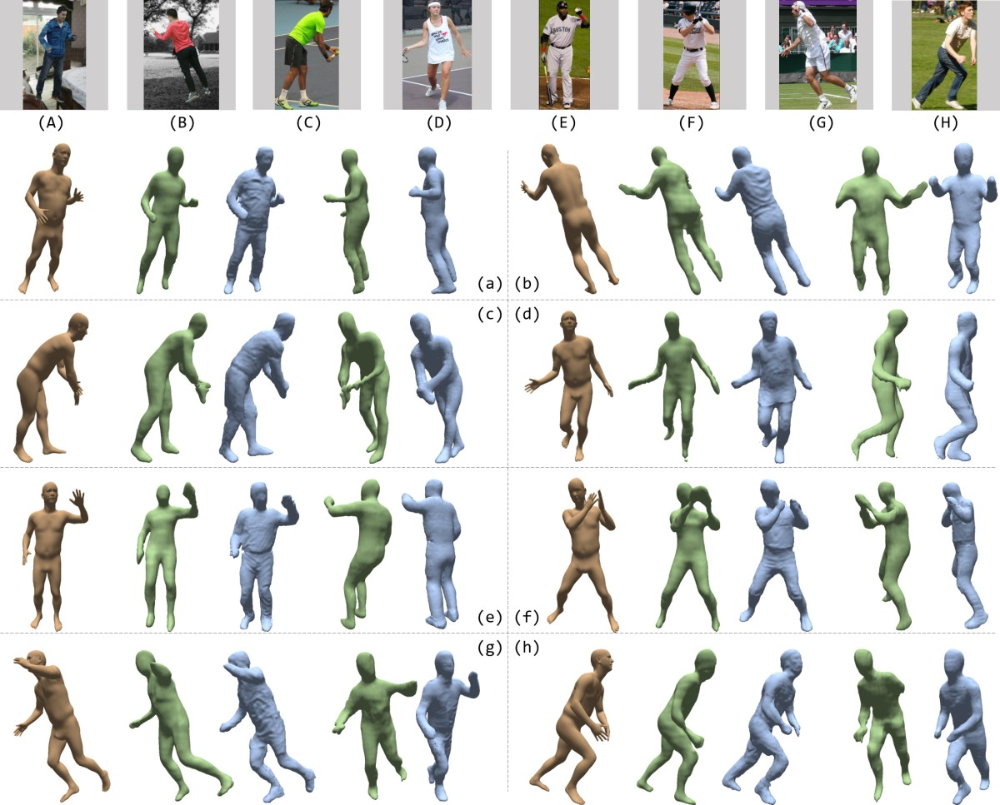

# DeepHuman: 3D Human Reconstruction from a Single Image
Zerong Zheng, Tao Yu, Yixuan Wei, Qionghai Dai, Yebin Liu.  ICCV 2019

[[Project Page]](http://www.liuyebin.com/deephuman/deephuman.html)
[[Paper]](http://openaccess.thecvf.com/content_ICCV_2019/papers/Zheng_DeepHuman_3D_Human_Reconstruction_From_a_Single_Image_ICCV_2019_paper.pdf)
[[Dataset]](https://github.com/ZhengZerong/DeepHuman/tree/master/THUmanDataset)




### Requirements
- python 2.7
- numpy
- tensorflow-gpu
- opendr
- opencv-python

### Installation
1. Setup im2smpl in ```path/to/im2smpl``` according to [this guidance](https://github.com/ZhengZerong/im2smpl)

2. Clone this repository and install required libraries:
    ```bash
    cd path/to/deephuman
    git clone https://github.com/ZhengZerong/DeepHuman
    cd DeepHuman
    vertualenv deephuman_env
    source deephuman_env/bin/activate
    pip install -r requirements.txt
    ```

3. Build voxelizer:
    ```bash
    cd voxelizer 
    mkdir build & cd build
    cmake ..
    make
    ```

4. Change the path configuration at LINE ```23``` of ```main_prepare_natural_img.py``` accordingly

5. Download our pre-trained model:
    ```bash
    mkdir results & cd results
    wget https://github.com/ZhengZerong/DeepHuman/releases/download/0.0/results_final_19_09_30_10_29_33.tar.gz
    tar -xzf results_final_19_09_30_10_29_33.tar.gz
    ```

### Testing
Prepare your image (cropping and resizing to 512x512) and run:
```bash
python2 main_prepare_natural_img.py --file ./examples/img.jpg
python2 main_infer_natural_img.py --file ./examples/img.jpg
```

### Training
Coming soon...


### LICENSE
>Please read carefully the following terms and conditions and any accompanying documentation before you download and/or use DeepHuman Software/Data (the "Software"). By downloading and/or using the Software, you acknowledge that you have read these terms and conditions, understand them, and agree to be bound by them. If you do not agree with these terms and conditions, you must not download and/or use the Software. 
>
>**Ownership**
>
>The Software has been developed at the Tsinghua University and is owned by and proprietary material of the Tsinghua University. 
>
>**License Grant**
>
>Tsinghua University grants you a non-exclusive, non-transferable, free of charge right: 
>
>To download the Software and use it on computers owned, leased or otherwise controlled by you and/or your organisation;
>
>To use the Software for the sole purpose of performing non-commercial scientific research, non-commercial education, or non-commercial artistic projects. 
>
>Any other use, in particular any use for commercial purposes, is prohibited. This includes, without limitation, incorporation in a commercial product, use in a commercial service, as training data for a commercial product, for commercial ergonomic analysis (e.g. product design, architectural design, etc.), or production of other artifacts for commercial purposes including, for example, web services, movies, television programs, mobile applications, or video games. The Software may not be used for pornographic purposes or to generate pornographic material whether commercial or not. This license also prohibits the use of the Software to train methods/algorithms/neural networks/etc. for commercial use of any kind. The Software may not be reproduced, modified and/or made available in any form to any third party without Tsinghua University’s prior written permission. By downloading the Software, you agree not to reverse engineer it. 
>
>**Disclaimer of Representations and Warranties**
>
>You expressly acknowledge and agree that the Software results from basic research, is provided “AS IS”, may contain errors, and that any use of the Software is at your sole risk. TSINGHUA UNIVERSITY MAKES NO REPRESENTATIONS OR WARRANTIES OF ANY KIND CONCERNING THE SOFTWARE, NEITHER EXPRESS NOR IMPLIED, AND THE ABSENCE OF ANY LEGAL OR ACTUAL DEFECTS, WHETHER DISCOVERABLE OR NOT. Specifically, and not to limit the foregoing, Tsinghua University makes no representations or warranties (i) regarding the merchantability or fitness for a particular purpose of the Software, (ii) that the use of the Software will not infringe any patents, copyrights or other intellectual property rights of a third party, and (iii) that the use of the Software will not cause any damage of any kind to you or a third party. 
>
>**Limitation of Liability**
>
>Under no circumstances shall Tsinghua University be liable for any incidental, special, indirect or consequential damages arising out of or relating to this license, including but not limited to, any lost profits, business interruption, loss of programs or other data, or all other commercial damages or losses, even if advised of the possibility thereof. 
>
>**No Maintenance Services**
>
>You understand and agree that Tsinghua University is under no obligation to provide either maintenance services, update services, notices of latent defects, or corrections of defects with regard to the Software. Tsinghua University nevertheless reserves the right to update, modify, or discontinue the Software at any time. 
>
>**Publication with the Software**
>
>You agree to cite the paper describing the software and algorithm as specified on the download website. 
>
>**Media Projects with the Software**
>
>When using the Software in a media project please give credit to Tsinghua University. For example: the Software was used for performance capture courtesy of the Tsinghua University. 
>
>**Commercial Licensing Opportunities**
>
>For commercial use and commercial license please contact: liuyebin@mail.tsinghua.edu.cn. 


### Citation
If you use this code for your research, please consider citing:
```
@InProceedings{Zheng2019DeepHuman, 
    author = {Zheng, Zerong and Yu, Tao and Wei, Yixuan and Dai, Qionghai and Liu, Yebin},
    title = {DeepHuman: 3D Human Reconstruction From a Single Image},
    booktitle = {The IEEE International Conference on Computer Vision (ICCV)},
    month = {October},
    year = {2019}
}
```

### Contact
- Zerong Zheng [(zrzheng1995@foxmail.com)](mailto:zrzheng1995@foxmail.com)
- Yebin Liu [(liuyebin@mail.tsinghua.edu.cn)](mailto:liuyebin@mail.tsinghua.edu.cn)
